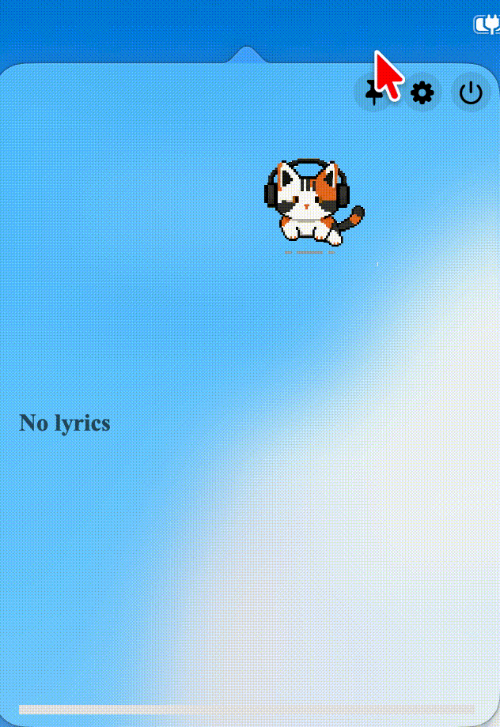

<p align="center">
  
</p>

<h1 align="center">MenuBarLyrics 🎵</h1>
<p align="center">精致的 macOS 菜单栏歌词工具 / A sleek macOS menu bar lyrics companion</p>

<p align="center">
  
  
  
  
  
</p>

---

## Installation / 安装

### Manual / 手动安装

从 [Releases](https://github.com/angus13175-gif/MenuBarLyrics/releases) 页面下载最新版本。
Download the latest version from the [Releases](https://github.com/angus13175-gif/MenuBarLyrics/releases) page.

> **⚠️ 首次打开**：双击后如果提示「无法验证开发者」，打开 **系统设置 → 隐私与安全性**，在「安全性」一栏点击 **「仍要打开」**。
> **⚠️ First launch**: If macOS blocks the app, go to **System Settings → Privacy & Security** → scroll to "Security" → click **"Open Anyway"**.

### Build from Source / 从源码构建

```bash
git clone https://github.com/angus13175-gif/MenuBarLyrics.git
cd MenuBarLyrics

# 构建 mediaremote-adapter（需 CMake + Xcode）
cd third-party/mediaremote-adapter
cmake -S . -B build -DCMAKE_BUILD_TYPE=Release
cmake --build build --config Release
cp -R build/MediaRemoteAdapter.framework ../../MenuBarLyrics/Resources/
cd ../..

# 编译 + 安装
./scripts/build-app.sh --install
```

无需签名 / Skip signing: `CODESIGN_IDENTITY="-" ./scripts/build-app.sh --install`

---

## Requirements / 系统要求

- macOS 15.4 (Sequoia) 或更高版本 / or later
- Apple Silicon (M1/M2/M3/M4/M5)

---

## Features / 功能

- 🎧 **多播放器支持** — 兼容 Apple Music、QQ 音乐、网易云音乐、Spotify 等使用 macOS 媒体系统的播放器
- 🎧 **Multi-player support** — Works with Apple Music, QQ Music, NetEase Cloud Music, Spotify, and other players using macOS media system
- 🔍 **自动搜索歌词** — 从多个歌词源自动获取同步歌词
- 🔍 **Auto-fetch lyrics** — Automatically search & download synced lyrics from multiple sources
- 📺 **菜单栏 + 弹窗双模式** — 在菜单栏滚动显示歌词，点击展开完整歌词面板
- 📺 **Menu bar + popover** — Scrolling lyrics in the menu bar; click to expand full lyric panel
- 🐱 **像素猫咪伙伴** — 4 种猫咪皮肤，根据播放状态切换动画（待机 / 走路 / DJ打碟）
- 🐱 **Pixel cat companion** — 4 cat skins with playback-aware animations (idle / walking / DJ)
- 🎨 **自定义外观** — 可调整字体、字号、粗细、颜色、菜单栏宽度
- 🎨 **Customizable appearance** — Adjust font, size, weight, color, and menu bar width
- ⏱️ **歌词偏移** — 支持全局和逐句歌词时间偏移（-5 ~ +5 秒）
- ⏱️ **Offset adjustment** — Global and per-song lyric offset (-5 ~ +5 seconds)

---

## Screenshot / 截图

<p align="center">
  <em>菜单栏歌词 + 猫咪打碟 / Menu bar lyrics + DJ cat</em><br>
  
</p>

<p align="center">
  <em>完整歌词面板 / Lyrics panel</em><br>
  
</p>

<p align="center">
  <em>🐱 猫咪待机 / Cat idle</em><br>
  
</p>

<p align="center">
  <em>🐱 四种猫咪皮肤 / Four cat skins</em><br>
  
  
  
  
</p>

---

## Credit / 致谢

### Components / 组件
- [mediaremote-adapter](https://github.com/ungive/mediaremote-adapter) — macOS 媒体信息桥接 / macOS media info bridge (BSD 3-Clause)

### Lyrics Sources / 歌词源
- [LRCLIB](https://lrclib.net) — 开放歌词数据库 / Open lyric database API
- QQ 音乐 / QQ Music — 实验性歌词源 / Experimental lyrics source
- 网易云音乐 / NetEase Cloud Music — 实验性歌词源 / Experimental lyrics source

---

## ⚠️ Disclaimer / 免责声明

> **English:**
> All lyrics are property and copyright of their owners. This tool is for personal learning and research purposes only. It does not host, distribute, or modify any lyric content. Some lyric sources use unofficial APIs — users are responsible for complying with the respective platforms' terms of service. This application uses macOS private frameworks (MediaRemote) and is not available on the Mac App Store. The author assumes no liability for any consequences arising from the use of this software.
>
> **中文:**
> 所有歌词版权归原作者及版权方所有。本工具仅供个人学习和研究使用，不提供歌词托管、分发或修改服务。部分歌词源使用了非官方 API，使用者应自行遵守相关平台的服务条款。本应用使用了 macOS 私有框架（MediaRemote），无法上架 Mac App Store。作者不对使用本工具产生的任何后果承担责任。

---

## License / 许可证

本项目采用 [MIT License](LICENSE)。 / This project is licensed under the [MIT License](LICENSE).

内含 mediaremote-adapter 采用 [BSD 3-Clause License](third-party/mediaremote-adapter/LICENSE)。 / Bundled mediaremote-adapter is licensed under [BSD 3-Clause](third-party/mediaremote-adapter/LICENSE).
